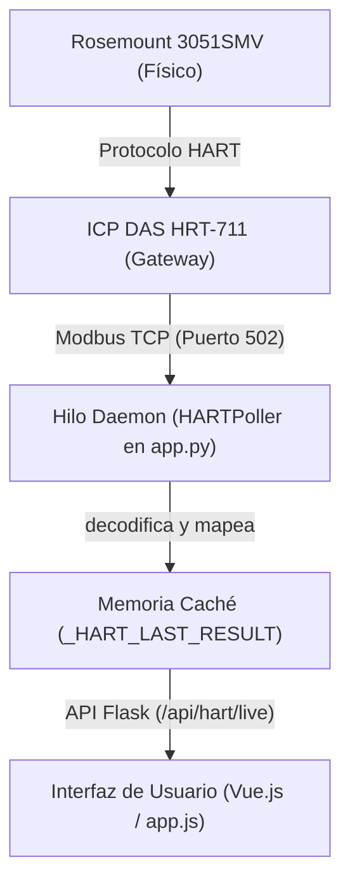

# Documentación de Mapeo de Variables Modbus HART
## MFM ORINOCO

Este documento explica cómo funciona la adquisición, decodificación y mapeo de las variables de proceso (PV) de un instrumento multivariable (Rosemount 3051SMV) a través de un gateway Modbus TCP/IP (ICP DAS HRT-711) hacia la plataforma MFM ORINOCO.

---

## 1. Arquitectura General de Comunicación

El flujo de datos se realiza a través de los siguientes componentes:



---

## 2. Direccionamiento y Lectura Modbus (ICP DAS HRT-711)

El gateway **HRT-711** recopila periódicamente las variables del lazo HART y las expone en registros Modbus.
Para simplificar la decodificación de números de coma flotante (IEEE 754), el gateway ofrece el **Formato 1 (Float Only)** a partir de la dirección Modbus **1300**.

Realizamos la lectura mediante **Función 04 (Read Input Registers)** solicitando **10 Words (registros de 16 bits)**:

| Registro Modbus | Variable HART | Descripción física | Valor de ejemplo |
| :--- | :--- | :--- | :--- |
| **1300 - 1301** | PV Current | Corriente del lazo en miliamperios (mA) | `4.0410 mA` |
| **1302 - 1303** | Primary Variable (PV) | **Flow (Caudal)** | `349.48 SCFH` |
| **1304 - 1305** | Secondary Variable (SV) | **Differential Pressure (DP)** | `4.26 inH2O` |
| **1306 - 1307** | Tertiary Variable (TV) | **Static Pressure (SP)** | `-3.05 psig` |
| **1308 - 1309** | Quaternary Variable (QV) | **Temperature** | `78.35 °F` |

---

## 3. Decodificación de Registros y Mapeo en el Backend
### Archivo Clave: [comunicacion_hart.py](file:///c:/xampp/htdocs/X4-1.1%20-%20copia19052026daqfuncionales/X4-1.1%20-%20copia/python_migration/comunicacion_hart.py)

#### 3.1. Formato de Byte-Swapping (BADC)
El gateway entrega los valores flotantes en orden de bytes swap/BADC. El decodificador desempaqueta los bytes en formato Big-Endian usando la biblioteca `struct` de Python:

```python
def decode_badc(r0, r1):
    try:
        # Formato '<HH' desempaqueta como Little-Endian de 16 bits, y luego '>f' a Big-Endian float
        return struct.unpack('>f', struct.pack('<HH', r0, r1))[0]
    except:
        return 0.0
```

#### 3.2. Líneas Clave de Mapeo y Ajustes
En la función [_parse_registers](file:///c:/xampp/htdocs/X4-1.1%20-%20copia19052026daqfuncionales/X4-1.1%20-%20copia/python_migration/comunicacion_hart.py#L192), extraemos y asignamos las variables adecuadamente:

```python
# 1. Decodificación de las variables desde sus respectivos registros
val_flow = decode_badc(regs[2], regs[3]) if len(regs) >= 4 else 0.0
val_dp   = decode_badc(regs[4], regs[5]) if len(regs) >= 6 else 0.0
val_pres = decode_badc(regs[6], regs[7]) if len(regs) >= 8 else 0.0
val_temp = decode_badc(regs[8], regs[9]) if len(regs) >= 10 else 0.0

# 2. Conversión y Mapeo
pv_1 = val_flow
pv1_unit = "SCFH"

pv_2 = val_dp
pv2_unit = "inH2O"

# El transmisor envía presión manométrica (-3.05 psig), sumamos 14.5 psi
# para convertir a presión absoluta (11.45 psia) y coincidir con la pantalla del instrumento
pv_3 = 14.5 + val_pres 
pv3_unit = "psi"

pv_4 = val_temp
pv4_unit = "°F"
```

---

## 4. Visualización en la Interfaz de Usuario
### Archivo Clave: [app.js](file:///c:/xampp/htdocs/X4-1.1%20-%20copia19052026daqfuncionales/X4-1.1%20-%20copia/static/js/app.js)

En la interfaz Vue de la página **⚡ Configuración Modbus HART**, actualizamos las etiquetas informativas y el número de decimales visibles para asegurar coincidencia exacta visual:

```html
<!-- PV 1 - Caudal -->
<div class="bg-bg-primary rounded-lg p-3 border-l-2 border-accent-green">
  <div class="text-xs text-gray-500">PV 1 (Flow / Caudal) <span class="text-[10px] ml-1 bg-gray-700 px-1 rounded text-gray-300">Unidad: {{ live.connected ? live.pv1.unit : '-' }}</span></div>
  <div class="text-lg font-mono font-bold text-white">{{ live.connected ? live.pv1.value.toFixed(2) : '--' }}</div>
</div>

<!-- PV 2 - Presión Diferencial -->
<div class="bg-bg-primary rounded-lg p-3 border-l-2 border-accent-green">
  <div class="text-xs text-gray-500">PV 2 (DP / Pres. Dif.) <span class="text-[10px] ml-1 bg-gray-700 px-1 rounded text-gray-300">Unidad: {{ live.connected ? live.pv2.unit : '-' }}</span></div>
  <div class="text-lg font-mono font-bold text-white">{{ live.connected ? live.pv2.value.toFixed(2) : '--' }}</div>
</div>

<!-- PV 3 - Presión Estática -->
<div class="bg-bg-primary rounded-lg p-3 border-l-2 border-accent-green">
  <div class="text-xs text-gray-500">PV 3 (SP / Pres. Est.) <span class="text-[10px] ml-1 bg-gray-700 px-1 rounded text-gray-300">Unidad: {{ live.connected ? live.pv3.unit : '-' }}</span></div>
  <div class="text-lg font-mono font-bold text-white">{{ live.connected ? live.pv3.value.toFixed(2) : '--' }}</div>
</div>

<!-- PV 4 - Temperatura -->
<div class="bg-bg-primary rounded-lg p-3 border-l-2 border-accent-green">
  <div class="text-xs text-gray-500">PV 4 (Temp / Temperatura) <span class="text-[10px] ml-1 bg-gray-700 px-1 rounded text-gray-300">Unidad: {{ live.connected ? live.pv4.unit : '-' }}</span></div>
  <div class="text-lg font-mono font-bold text-white">{{ live.connected ? live.pv4.value.toFixed(1) : '--' }}</div>
</div>
```

---

## 5. Resumen del Impacto de los Cambios

> [!TIP]
> 1. **Mapeo Realista:** Antes, la interfaz no mapeaba la variable `Caudal (Flow)` y mostraba `Temperatura` en el lugar incorrecto. Ahora las 4 variables coinciden en orden lógico.
> 2. **Compensación de Presión:** Al sumar `14.5` a la presión estática, el valor refleja la misma presión absoluta que se visualiza en la pantalla física del instrumento.
> 3. **Unidades Dinámicas:** Se reemplazaron códigos numéricos crudos por etiquetas legibles como `"SCFH"`, `"inH2O"`, `"psi"`, `"°F"`.
